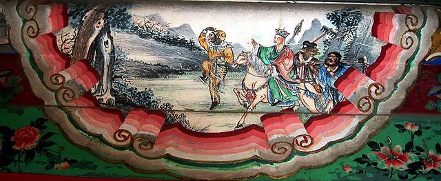

# Computational Text Analysis of Journey-to-the-West

## Abstraction

The novel "Journey to the West" is a classic Chinese literary work renowned for its rich cast of characters and profound themes. This project explores the character development and frequencies of characters in the novel. Through a comprehensive analysis, this research sheds light on how the characters evolve and the patterns of their appearances throughout the narrative. To achieve this objective, the study begins with a thorough examination of the main characters in "Journey to the West," including Tan Sanzang, Sun Wukong, Zhu Bajie, Sha Wujing, and others. Each character's distinctive traits, motivations, and roles are identified to establish a foundation for their growth in the journey. 

The research then delves into the character development aspect, tracing the evolution of each character throughout the story. Key events, challenges, and encounters that contribute to their growth are identified and analyzed. The study also investigates turning points and pivotal moments that shape their personalities. The study is interpreting the findings and drawing connections between character development and frequencies.The significance of these findings is discussed in relation to the novel's themes, narrative structure, and overall impact. 

Overall, this project offers a comprehensive exploration of character development and frequency analysis in "Journey to the West." By studying the evolution of characters and their appearances, the research contributes to a deeper understanding of this iconic literary work, its themes, and its enduring relevance.

